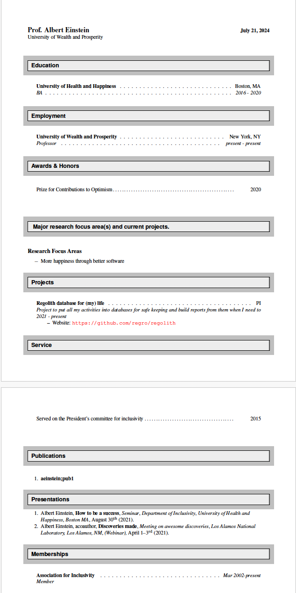

.. role:: bash(code)
   :language: bash
.. role:: python(code)
   :language: python

.. raw:: html

   <link href="_static/unicodetiles.css" rel="stylesheet" type="text/css" />
   
   
   

      
<h1>welcome to the regolith docs</h1>

   

   

#######
|title|
#######

.. |title| replace:: regolith documentation

Regolith is a content management system for software & research groups.
Regolith creates and manages a database of people, publications, projects,
proposals & grants, courses, and more! From this database, regolith is then
able to:

* Generate a group website,
* Generate CVs and publication lists for the group members,
* Act as a grade book for your courses, and more!

Databases may be file-based (JSON and YAML) or MongoDB-based.

Regolith is developed as a `regro project <https://regro.github.io/>`_

| Software version |release|
| Last updated |today|.

=======
Authors
=======

regolith was mostly written by Anthony Scopatz, with significant contributions
from CJ Wright.  More recently development has been led By simon Billinge and
regolith is currently developed by the Billinge Group
and its community contributors.

For a detailed list of contributors see
https://github.com/regro/regolith/graphs/contributors.

=============
Example Sites
=============
The following are some sample websites that are powered by regolith, even though
building
websites is just one of the many facets of this tool:

1. `ERGS Home Page <http://www.ergs.sc.edu>`_
2. `Technical WorkShop on Fuel Cycle Simulation <http://twofcs.ergs.sc.edu>`_

============
Installation
============
1. Make your first database
----------------------------
The quickest way to get started is to set up your first minimal database using a
handy cookie cutter.  These instructions use the command line and assume you know
how to use the terminal/cmd prompt, and that you know how to install software from
either Pypi using :bash:`pip` or Anaconda/Miniconda using :bash:`conda`.  The
instructions use the linux shell commands which should work on Mac and linux
computers, and on windows if you are running from at Git Bash terminal (recommended)
but will be slightly different (but still work) on a windows cmd terminal.

First install the cookiecutter package if you don't already have it

.. code-block:: sh

    $ conda install cookiecutter

or

.. code-block:: sh

    $ pip install cookiecutter

Next, clone the GitHub repository with the handy beginning database template

.. code-block:: sh

    $ git clone git@github.com:sbillinge/regolithdb-cookiecutter.git

to get it using SSH or

.. code-block:: sh

    $ git clone https://github.com/sbillinge/regolithdb-cookiecutter.git

to get it using the HTTPS protocol (just use whichever works for you)

Make a note of the path to the resulting :bash:`regolithdb-cookiecutter` directory,
(e.g., :bash:`/c/Users/me/scratch/regolithdb-cookiecutter` but yours will be different).
This is not your database, this is just the template and will be removed shortly.

Next, in a new terminal, or in the same terminal, move to the directory where
you want to install your own permanent database.  For example, we like to
create a directory off our home directory called :bash:`dbs` where we will keep
all of our databases (believe me, once you start using Regolith you will want
to make more and more)

.. code-block:: bash

    $ cd ~        # takes you to your home directory
    $ mkdir dbs   # creates the dbs directory if it is not already there
    $ cd dbs      # change dir to the new dbs directory

Now by running cookiecutter your starting db will be built from the template

.. code-block:: bash

    $ cookiecutter <path>/<to>/regolithdb-cookiecutter

The program will ask a series of questions and you can type responses.  Take your
time and answer the questions as accurately as possible, because you are already
entering data into your database!

Here is an example, and the questions look like

.. code-block:: bash

    $ cookiecutter ~/scratch/regolithdb-cookiecutter/
    database_name [my-cv-db]:
    my_first_name [Albert]: Simon
    my_last_name [Einstein]: Billinge
    id_for_me [aeinstein]: sbillinge
    my_group_name [Einstein Group]: Billinge Group

and so on.  If you just hit enter the cookie-cutter will use the default values
and you will build a database for Einstein, but type the values you want in
answer to each question to make your own.

If you make a mistake just type CTL^C
and do it again.  You may have to remove the directory if it has already been
created, for example, :bash:`$ rm -r my-cv-db`.  Watch what you type here and
be careful not to remove something you care about by mistake!

When you are happy with your database setup, type

.. code-block:: bash

    $ ls

which lists all the files in your current directory,
and you should see a directory called :bash:`my-cv-db` or whatever you chose to
call you database.  OK, let's go and look at our database.  change directory into it and do a directory
listing,

.. code-block:: bash

    $ cd my-cv-db
    $ ls

or open a file
browser such as windows explorer and check out what is in there.

You will see a directory called :bash:`db` and a file called :bash:`regolithrc.json`.
All of the collections in your database are in the :bash:`db` directory.  The
:bash:`regolithrc.json` contains a bunch of information that Regolith needs to run and do its business.

You can use the Regolith program to do many things with, and to, your
database. But you must always run Regolith from a directory that contains a
:bash:`regolithrc.json` file.  Since you are in a directory that contains one,
you can run Regolith from here, but first you have to install it....

2. install Regolith
---------------------
Regolith packages are available from conda-forge and PyPI:

**conda:**

.. code-block:: sh

    $ conda install -c conda-forge regolith

**pip:**

.. code-block:: sh

    $ pip install regolith

The Regolith code is migrating quickly these days.  If you prefer you can
install from the GitHub repository mode and get the latest changes.
In that case, clone the `GitHub repository  <https://github.com/regro/regolith>`_,
change directory to the top level directory in that cloned repository where the
:bash:`setup.py` file is.  From inside your virtual environment, type

.. code-block:: sh

    $ pip install regolith -e

which installs regolith in this environment in develop mode.  In this mode, the
version of Regolith you run will change each time you update from the repo
leading to instability so be careful.

To check that your installation is working, let's have Regolith make us a
todo list from our database.

Make sure you are in a directory that
contains a :bash:`regolithrc.json` file (which you should be, i.e., the
top level directory of :bash:`~/dbs/my-cv-db`, if you have been
following these instructions) and type

.. code-block:: sh

    $ regolith helper l_todos

and you should see something like

.. code-block:: sh

    loading .\./db\todos.yml...
    dumping todos...
    usage: regolith helper [-h] [-s STATI [STATI ...]] [--short [SHORT]]
                           [-t TAGS [TAGS ...]] [-a ASSIGNED_TO]
                           [-b [ASSIGNED_BY]] [--date DATE]
                           [-f FILTER [FILTER ...]]
                           helper_target

    positional arguments:
      helper_target         helper target to run. Currently valid targets are:
                            ['a_expense', 'a_grppub_readlist', 'a_manurev',
                            'a_presentation', 'a_projectum', 'a_proposal',
                            'a_proprev', 'a_todo', 'f_prum', 'f_todo',
                            'l_abstract', 'l_contacts', 'l_grants', 'l_members',
                            'l_milestones', 'l_progress', 'l_projecta', 'l_todo',
                            'u_contact', 'u_institution', 'u_logurl',
                            'u_milestone', 'u_todo', 'v_meetings', 'lister',
                            'makeappointments']

    optional arguments:
      -h, --help            show this help message and exit
      -s STATI [STATI ...], --stati STATI [STATI ...]
                            Filter tasks with specific status from ['started',
                            'finished', 'cancelled', 'paused']. Default is
                            started.
      --short [SHORT]       Filter tasks with estimated duration <= 30 mins, but
                            if a number is specified, the duration of the filtered
                            tasks will be less than that number of minutes.
      -t TAGS [TAGS ...], --tags TAGS [TAGS ...]
                            Filter tasks by tags. Items are returned if they
                            contain any of the tags listed
      -a ASSIGNED_TO, --assigned-to ASSIGNED_TO
                            Filter tasks that are assigned to this user id.
                            Default id is saved in user.json.
      -b [ASSIGNED_BY], --assigned-by [ASSIGNED_BY]
                            Filter tasks that are assigned to other members by
                            this user id. Default id is saved in user.json.
      --date DATE           Enter a date such that the helper can calculate how
                            many days are left from that date to the due-date.
                            Default is today.
      -f FILTER [FILTER ...], --filter FILTER [FILTER ...]
                            Search this collection by giving key element pairs.
                            '-f description paper' will return tasks with
                            description containing 'paper'
    If the indices are far from being in numerical order, please renumber them by running regolith helper u_todo -r
    (index) action (days to due date|importance|expected duration (mins)|tags|assigned by)
    --------------------------------------------------------------------------------
    started:
    (1) Do all the things to set up todos in regolith (59|3|60.0||None)
    ------------------------------
    Tasks (decreasing priority going up)
    ------------------------------
    2021-07-29(59 days): (1) Do all the things to set up todos in regolith (59|3|60.0||None)
    ------------------------------
    Deadlines:
    ------------------------------

After all the help messages is your list of Todo items.  There is just one item,
:bash:`Do all the things to set up todos in regolith`.

OK, your Regolith is working.  If it isn't working, consider joining, browsing
and posting questions to the `regolith-users <https://groups.google.com/u/1/g/regolith-users>`_
Google group.

Quick(ish) Start
================
OK, let's use Regolith to build our cv.  Why not.  again, in a terminal navigate
to the top level directory of your database (where the :bash:`regolithrc.json`
file is). and type:

.. code-block:: sh

    $ regolith build cv

Regolith will take information from the various collections in your database and
build them into your academic cv according to a pre-determined template.  The
current template builds the cv using latex.  If your computer has latex installed
and Regolith can find it, your cv should appear as a pdf document in the directory
:bash:`my-cv-db/_build` (or more generally :bash:`<path>/<to>/<database_name>/_build`).
All your built documents will appear in the :bash:`_build`
directory.

If you don't have latex installed we can  have Regolith build the latex
source file for the cv but without trying to
render it to PDF,

.. code-block:: sh

    $ regolith build cv --no-pdf

The latex source is a text file that you will find in the :bash:`_build` directory
and you can open it in a text editor.  Even without latex installed you can
render it by opening a free account at http://overleaf.com starting a new blank
project, uploading the :bash:`<filename>.tex` and :bash:`<filename>.bib` files to
that project and hitting the :bash:`recompile` button.

Whether it builds on your computer or on overleaf, it should look something like

If, for some reason, the publication list doesn't render
correctly, try running the latex command again.  If you are going to
do much building with regolith it is definitely recommended to install latex on
your computer, such as MikTeX for windows (latex comes installed with many linux
systems and is easily installed on IOS).

What Next?
===========

You have not spent too much time entering data into your database yet, but you
can already build a number of different things.  Try building your
resume (:bash:`$ regolith build resume`), your publication list
(:bash:`$ regolith build publist`) and your presentation list
(:bash:`$ regolith build preslist`).  You can even build a web-page
for your group (:bash:`$ regolith build html`).  It will look pretty
ugly until we set it up properly with a nice template, but all the content
will be dynamically built from the latest info in your databases.

To see everything you can build, type :bash:`$ regolith build --help`.
To build some of those things you will need more collections that are not
in the cookie cutter template, for example,
:bash:`proposals` and :bash:`grants` collections, but you get the idea.

So next we might want to work on those collections and start adding more data.
This can be done in a couple of ways.  Probably the simplest to begin
with is just use a text editor or IDE like PyCharm.   The :bash:`yml` files are
yaml files, which is a human readable way of storing information that can be
read and understood by python.  Please read about it `here <https://en.wikipedia.org/wiki/YAML>`_
if you are not familiar with it. However, briefly to get you started, it encodes
whether information is part of a list or a dictionary by indentation and semantics.
For example,

.. code-block:: sh

    key:
      - list item
      - another list item

would be read by python as :python:`{"key": ["list item", "another list item"]}`,
and a collection consisting of a list of dictionaries would look like this in yaml:

.. code-block:: sh

    id:
      - name: Arthur
        quest: To find the Holy Grail
        favorite_color: Blue
      - name: Sir Lancelot
        quest: To find the Holy Grail
        favorite_color: Green, no pink

Long story short, you can update your database by directly editing the file,
and this is quick and easy when you get comfortable with the YAML syntax,
but can be frustrating as you are learning it.

If you want to check what
fields are allowed or required in a collection look at the Collections part of
the docs, :ref:`regolith_collections`, which are built from the Regolith schema
(or directly look at the
schema in :bash:`schema.py`).  You can automatically check if your database
edits are valid by running :bash:`$ regolith validate`.

Getting Help from Helpers
==========================
Regolith builders build documents, but there are a small but growing number of
tools that either will run popular queries on the database and print the results
to the terminal ("lister helpers" with :bash:`l_` prefixes -- you
already used one,
it was the lister helper that builds your todo list).

There are also helpers
that help you to add documents to your database collections.  These are
"adder helpers"  with :bash:`a_` prefixes.  An important adder helper is
:bash:`a_todo` helper that will add a todo item to your list.

"Updater
helpers" will update existing entries in your databases and have prefix
:bash:`u_`.

An important special kind of updater helper is a "finish helper" that will mark
something as finished (and give it a finish date).  So when you do that
pesky 15th todo item on your todo list, run
:bash:`regolith helper f_todo -i 15` to finish it.

That is a lot of typing to finish a todo, so consider setting up an alias in
the config file for your terminal program (my terminals run bash so I put the
alias in the :bash:`.bashrc` file in my home directory (:bash:`$ cd ~` to get there).
With this alias I just type :bash:`rhlt 15` to finish that 15th todo item.

To explore what helpers are there so you can play with them, type

.. code-block:: sh

    $ regolith helper

and hit return.  It will return a list of available helpers, e.g.,

.. code-block:: sh

    $ regolith helper
        usage: regolith helper [-h] helper_target
        regolith helper: error: the following arguments are required: helper_target
        usage: regolith helper [-h] helper_target

        positional arguments:
          helper_target  helper target to run. Currently valid targets are:
                         ['a_expense', 'a_grppub_readlist', 'a_manurev',
                         'a_presentation', 'a_projectum', 'a_proposal', 'a_proprev',
                         'a_todo', 'f_prum', 'f_todo', 'l_abstract', 'l_contacts',
                         'l_grants', 'l_members', 'l_milestones', 'l_progress',
                         'l_projecta', 'l_todo', 'u_contact', 'u_institution',
                         'u_logurl', 'u_milestone', 'u_todo', 'v_meetings', 'lister',
                         'makeappointments']

then if you want to know how to use any of the helpers type

.. code-block:: sh

    $ regolith helper <helper target>

and hit return, e.g.,

.. code-block:: sh

    $ regolith helper l_contacts
    usage: regolith helper [-h] [-v] [-n NAME] [-i INST] [-d DATE] [-r RANGE]
                           [-o NOTES] [-f FILTER [FILTER ...]]
                           [-k KEYS [KEYS ...]]
                           helper_target run
    regolith helper: error: the following arguments are required: run
    usage: regolith helper [-h] [-v] [-n NAME] [-i INST] [-d DATE] [-r RANGE]
                           [-o NOTES] [-f FILTER [FILTER ...]]
                           [-k KEYS [KEYS ...]]
                           helper_target run

    positional arguments:
      helper_target         helper target to run. Currently valid targets are:
                            ['a_expense', 'a_grppub_readlist', 'a_manurev',
                            'a_presentation', 'a_projectum', 'a_proposal',
                            'a_proprev', 'a_todo', 'f_prum', 'f_todo',
                            'l_abstract', 'l_contacts', 'l_grants', 'l_members',
                            'l_milestones', 'l_progress', 'l_projecta', 'l_todo',
                            'u_contact', 'u_institution', 'u_logurl',
                            'u_milestone', 'u_todo', 'v_meetings', 'lister',
                            'makeappointments']
      run                   run the lister. To see allowed optional arguments,
                            type "regolith helper l_contacts".

    optional arguments:
      -h, --help            show this help message and exit
      -v, --verbose         Increases the verbosity of the output.
      -n NAME, --name NAME  name or name fragment (single argument only) to use to
                            find contacts.
      -i INST, --inst INST  institution or an institution fragment (single
                            argument only) to use to find contacts.
      -d DATE, --date DATE  approximate date in ISO format (YYYY-MM-DD)
                            corresponding to when the contact was entered in the
                            database. Comes with a default range of 4 months
                            centered around the date; change range using --range
                            argument.
      -r RANGE, --range RANGE
                            range (in months) centered around date d specified by
                            --date, i.e. (d +/- r/2).
      -o NOTES, --notes NOTES
                            fragment (single argument only) to be found in the
                            notes section of a contact.
      -f FILTER [FILTER ...], --filter FILTER [FILTER ...]
                            Search this collection by giving key element pairs.
      -k KEYS [KEYS ...], --keys KEYS [KEYS ...]
                            Specify what keys to return values from when running
                            --filter. If no argument is given the default is just
                            the id.

you then would rerun the command giving all required, and any
optional, command
line arguments. e.g.,

.. code-block:: sh

    $ regolith helper l_contacts run --name frank -v

will return all contacts in the contacts collection where :bash:`frank` appears anywhere
in the name, such as :bash:`Frankie Valli`, :bash:`Baron von Frankenstein`
and :bash:`Anne Frank` (if they are in your contacts).  The :bash:`-v`
command stands for :bash:`verbose` which means more information is
returned than if you don't type :bash:`-v`.  You can try it now:

.. code-block:: sh

    $ regolith helper l_contacts run -n auth -v

Setting up Gitlab repository information for API requests
=========================================================

Some helpers have features that make API requests to GitLab (or GitHub). For example, the a_presentation helper has a functionality that
creates a repository in a designated GitLab group. In order to use these features, the target repository
information needs to be defined in your configuration files (:code:`regolithrc.json`, :code:`user.json`).

Setting up Destination Repo Information
---------------------------------------

The designated repository information should be defined in :code:`regolithrc.json` in the directory in which you are
running the helper. Create a collection of repository targets designated as :code:`repos` (see below for an example).
according to the following pattern.  We will use as an example an entry that will
allow :code:`a_presentation` to successfully create a repository in a group called `talks`
on a GitLab instance.

:code:`a_presentation` looks for a rep with the entry :code:`_id` with value ``"talk_repo"``.

.. code-block:: json

"repos":[
        {"_id": "talk_repo",     # a_presentation looks for the entry with this ID
         "params": {"namespace_id": "35",             # These params are handed to the API post request.
                    "initialize_with_readme": "True"  # "name" is also needed but a_presentation generates that automatically
                    },
         "url": "https://gitlab.example.com",  # The URL of the main GitLab/GitHub instance
         "api_route": "/api/v4/projects/",     # This is the route to the REST-API.  The value
                                               #   shown here is correct for GitLab at the time of writing
         "namespace_name": "talks"      # the name of group/org which corresponds to the namespace_id above.
        },
        {
            "_id": "another_example_repo",
            [...]
        }
    ]

The namespace ID is the repository's group ID which can be found on the target repository's main page.
The :code:`url` and :code:`api_route` should be in the format above, including the dashes.

For more information on the required request info, or to see a list of additional attributes
that can also be defined in the request (e.g. ``initialize_with_readme``, ``description``, etc.),
see GitHub or GitLab API documentation, e.g., for GitLab the `GitLab docs <https://docs.gitlab.com/ee/api/projects.html#create-project>`_.
(Note that additional attributes can be defined under ``params``, where needed.)

Setting up your Private Access Token
------------------------------------

Your personal/private API request token should be defined in :code:`user.json`, which can be found in your
~/.config directory. Similarly, define a distinct ID for each private token. For example, to create a repo
in GitLab, you should define your authentication token with the ID, ``"gitlab_private_token"``:

.. code-block:: json

    [
        {
            "_id": "gitlab_private_token",
            "token": "<private-token>"
        },
        {
            "_id": "example_token",
            [...]
        }
    ]

To learn more about creating a personal access token, refer to the
`Gitlab docs <https://docs.gitlab.com/ee/user/profile/personal_access_tokens.html#personal-access-tokens>`_.
Note that your personal access token should have the ``api`` scope enabled in order to make a successful request.

To change the target directory, you can change the parameters (or IDs) in the function
:code:`create_repo(destination_id, token_info_id, rc)` in `a_presentationhelper.py` to
the IDs of your desired repo info and corresponding token.

Setting up GitHub repository information for API requests
=========================================================

Using the filter capabilities in the helpers
============================================

Most helpers have a filter  field.  This allows you to filter the relevant collection
before running the helper functionality.

The logic of filter is the following.  A document will be valid if the value of key contains value for all keys and values using AND logic.

As an example, if we consider filtering in the :bash:`l_milestones` helper we will get the following behavior. :bash:`l_milestones` operates on the :bash:`projecta` collection, so the filter will be applied to this collection.
If you specify :bash:`--filter lead voe` it will return all documents where :bash:`voe` appears in the value for the :bash:`lead` field (e.g., if there is someone with an id of :bash:`carvoe` and another person with and id of :bash:`voedemort` the filter will return all the documents where either of these people are :bash:`lead`).

If you then select :bash:`current` and :bash:`verbose` the helper will do the normal thing of returning in verbose form the current milestones, but it will do it on the filtered collection.

A slight gotcha is that since filter uses "in" in its logic, if the type of the key value is a string it will find all strings that contain that fragment, as above, but if the type of the key value is a list it will return documents where the specified value is in the list, so :bash:`--filter group_member voe` will return all the documents where :bash:`voe` is listed as a group member, but it won't return any documents where :bash:`carvoe` or :bash:`voedemort` are listed as a group member.

The filter uses AND logic and operates such that :bash:`--filter lead voe grants mygrant21 status finished` will return all prums that are led by :bash:`carvoe` or :bash:`voedemort` that acknowledge the mygrant21 grant and are finished.  Actually, similar behavior can be obtained also by selecting :bash:`--lead voe --stati finished --filter grants mygrant21`

unfortunately the filter function does not currently recurse, so it will only operate on top level key-value pairs where the type of the value is a string or a list or a tuple.

Backing up and protecting your work
===================================
Now you have started saving your precious life's work in your regolith database
you better start protecting it and backing it up.  One low overhead approach
for this is simply to set up your database directory to be backed up remotely as
a Google drive or Dropbox synced directory, for example.

However, Regolith is set up to
work with git and GitHub and this is a powerful option if you are
comfortable with it.  This gets more useful when you want to start
sharing databases with group members, for example, using GitHub access rights.
It is also possible to make sure people's edits to the database won't
break things by setting up continuous integration (CI) that runs some
validation and builders and makes sure they don't crash before the
edits are accepted.  This is much more advanced usage which you
should save for later.

To get started with the GitHub option, the next thing to do is to turn your database directory
on your filesystem into a git repository and link it to a repository on
your personal space on GitHub (you will need a GitHub account).  You can make
that repo private so the world
cannot see your todo list, or public so that the world can see the web-page
you build from it.  We will get back to this later, but Regolith will build
collections from across databases, so you can have parts of your :bash:`people`
collection private and other parts public.  Depending which :bash:`regolithrc.json`
file you use to build with, you can pull from the public, or private, or both
parts.  Again, this is a peep to the future.
For now, let's assume you just want to back up and keep versions of
you private database.  You will make a repository on your personal GitHub account
and synchronize your local database with this repo.
`Instructions for doing this are here <https://docs.github.com/en/github/importing-your-projects-to-github/importing-source-code-to-github/adding-an-existing-project-to-github-using-the-command-line>`_

Once you get everything set up you will want to periodically (meaning
frequently) type

.. code-block:: sh

    $ git commit -a -m "my commit message"
    $ git push

This will add, commit and push all files that git is tracking that have been
updated locally.  If you add a new file to the repository and want it in the
GitHub backup, you will have to explicitly add it before committing,

.. code-block:: sh

    $ git add my_new_file.py
    $ git commit -m "an even more informative commit message"

:bash:`$ git commit` commits (i.e., checks in) to the git database (yes,
git, like you now, is using a database backend) everything that has been added, or staged, for commit.
:bash:`$ git commit -a` automatically adds all files that git is tracking
(have been previously committed in the past) that have been edited and then
commits them.

They are now safely captured in the git database and you can retrieve them
later if you accidentally delete your personal database or mess it up some other way.
But this version of the git database is still stored on your local computer, so
if you spill coffee on your computer, you may lose everything.  :bash:`$ git push` pushes all
these updates to a remote computer on the internet at the GitHub headquarters.
Git and GitHub form a wonderful but complicated infrastructure, it is well worth
getting to know how to use them well.  For now, we have used it to
secure your precious database.  Remember to make frequent pushes.

OK, you are started with your Regolith database.  Go play.  Regolith
can do many more complicated things to help with administering your
research group, or whatever you are working on.  We will continue to
add tutorials below explaining some of these things, so check back
from time to time.  And remember join and to ask questions at the `regolith-users <https://groups.google.com/u/1/g/regolith-users>`_
Google group.  They will get answered.

================
Acknowledgements
================

``regolith`` is built and maintained with `scikit-package <https://scikit-package.github.io/scikit-package/>`_.

Tutorials
=========
.. toctree::
    :maxdepth: 1

    tutorials/index

Run Control
===========

.. toctree::
    :maxdepth: 1

    rc

Database Collections
====================
**Collections** are the regolith (and mongo) abstraction for *tables*.
**Entries** (or *rows*) in
a collection must follow the schema defined below. In general, the following notions
hold:

* An entry is a dictionary with string keys.
* Each entry must contain a unique identifier. This is called ``"_id"`` in JSON
  and Mongo, and is simply the top-level key in YAML.
* A collection is a list of entries that follow the same schema.

Not all regolith actions will use every collection type. It is common for regolith
projects to just use some of the collections below. For example, building a group
website will use different collections than managing students and grades in a course!
With these points in mind, feel free to dive into the databases below!

.. toctree::
    :maxdepth: 2

    collections/index

Regolith API
============
For those who want to dive deeper into the library itself.

.. toctree::
    :maxdepth: 1

    api/regolith

=================
Table of contents
=================
.. toctree::
   :titlesonly:

   license
   release
   Package API <api/regolith>

Regolith Commands
=================
Shell commands for regolith

.. toctree::
     :maxdepth: 2

     commands/index

Database Maintenance
=========
.. toctree::
    :maxdepth: 1

    database_maintenance/index

=======
Indices
=======

* :ref:`genindex`
* :ref:`search`
